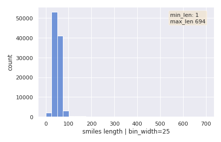
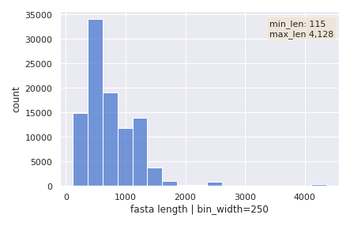
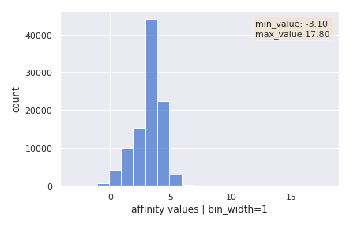

# Protein Ligand Binding Affinity 🧬  
 
[](https://weishengtoh-protein-ligand-binding-affi-app-introduction-4l7sb0.streamlitapp.com/)

The purpose of this project is to develop and train artificial intelligence 
models that are able to accurately predict how well a ligand will bind to a protein.  

Binding between a protein-ligand pair is typically measured using a scalar 
value known as the *“dissociation constant”*, which will be the target label 
in the **regression problem**.  

Hence in this project, the aim is to create and/or use existing models that 
predicts the dissociation constant for any given protein-ligand pair.  

> For a more comprehensive guide on how to use the project, head over to the [streamlit app](https://weishengtoh-protein-ligand-binding-affi-app-introduction-4l7sb0.streamlitapp.com/), 
where you will also be able to run your own inference on our pretrained models!  

## Installation 🛠️  
Clone the repository to your local environment using 

```shell
git clone https://github.com/weishengtoh/protein-ligand-binding-affinity.git
```

### Installing the dependencies with Conda/Docker  
The dependencies can either be installed directly into a conda environment 
from the `environment.yml` file, **OR** defined within a Docker image using 
the `Dockerfile`  

> **NOTE:** Running multi-GPUs training *(single node)* requires that the dependencies 
are defined using the docker image ***(option 2 below)*** 


1. **Setting up dependencies within a conda environment**  
    
    Create the conda environment from `environment.yml` file 
    ```shell
    conda env create -f environment.yml
    ```
    Activate the conda environment
    ```shell
    conda activate capstone_pytorch
    ```
2. **Setting up dependencies within a Docker image**  

    The docker image required is located in DockerHub at  
    ```html
    https://hub.docker.com/r/weishengtoh/capstone_pytorch/tags
    ```

    To download the image into your local machine, run the following command 
    in your terminal:  
    ```shell
    docker pull weishengtoh/capstone_pytorch:horovod_v1
    ```  
    Run the docker container interatively, mounting the volume and selecting the GPU(s).  
    Make sure that the volume mounted is the path to the project root folder.

    **Single GPU:**  
    ```shell
    docker run -it -v <volume_location>:/workspace --gpus '"device=<gpu>:<mig>"' <repository_name>:<tag>
    ```

    **Multi-GPUs, Single Node:**  
    ```shell
    docker run -it -v <volume_location>:/workspace --gpus '"device=<gpu1>,<gpu2>"' <repository_name>:<tag>
    ```

### Weights and Biases (wandb)  
The project uses [Weights and Biases](https://wandb.ai/site) heavily for experiment tracking, visualisations
and model versioning. Although it is not required, it is still recommended 
to run the training experiments with wandb support. To use wandb, you will 
need to have an account created, and the api key ready.  

As an alternative, TensorBoard has also been integrated into the codes, which 
allows the experiments to be visualised locally.  

## Usage 🌟  
There are several entry scripts to run the training/inference. In general 
however, the command to execute a script in the terminal has the format:   

```shell
python <entry_script> -C <path_to_config_file>
```  

To use horovod to train on multiple GPUs on a single node, use the command:  
```shell
horovodrun -np <number_of_gpus> python <entry_script> -C <path_to_config_file>
```  

> More details on the usage instructions are included in the [streamlit app!](https://weishengtoh-protein-ligand-binding-affi-app-introduction-4l7sb0.streamlitapp.com/)


## Dataset 📦

The dataset we were provided with consisted of **100,000** instances of protein-ligand 
pair, along with their binding affinity.  

Each instance in the dataset contains **two independent variables** and **one 
target variable**.  

The independent variables are the **protein sequence** and the 
**compound sequence**, which are in the [FASTA](https://en.wikipedia.org/wiki/FASTA_format) 
and [SMILES](https://en.wikipedia.org/wiki/Simplified_molecular-input_line-entry_system) 
format respectively.  


| VARIABLE | FORMAT | DESCRIPTION | TYPE | EXAMPLE |
| -------- | ------ | ----------- | ---- | --------|
| Ligand / Compound | SMILES | Potential Drug Compound | String | N=C(O)Nc1sc(-c2cccs2)cc1C(O)=N[C@H]1CCCNC1 | 
| Protein | FASTA | Protein Sequence | String | MSYKPNLAAHMPAAALNAAGSVHSPSTSMATSSQYR ... | 
| Affinity *(Target)* | Numerical | Binding Affinity | Float | 3.748188 |   

We can also gain some insights by plotting the distribution of the independent 
and target variables.  

| SMILES DISTRIBUTION | FASTA DISTRIBUTION | AFFINITY DISTRIBUTION | 
| :-----------------: | :----------------: | :-------------------: | 
|  |  |  | 

To handle the SMILES and FASTA inputs with varying length, we perform 
truncation and padding to length **100** and length **1000** respectively.  

The truncation and padding length also follows the typical approach used in 
most research papers covered, and in some cases is also guided by the 
limitations imposed by other pretrained models which we have used.  

It has also been observed that increasing the truncation and padding length 
significantly increases the training time, while the performance of the model 
remains relatively unchanged.   

The distribution of the target variable that we have used in our training is 
also important, as most of the affinity in our dataset are within 0 to 5, with 
a noticable peak around values 3 to 4. This will have a significant impact on 
the model generalisability, especially when used on datasets such as 
[Kiba](http://iilab.hit.edu.cn/dtadata/ElectraDTA/dataset/kiba-full-data.csv) or 
[Davis](http://iilab.hit.edu.cn/dtadata/ElectraDTA/dataset/davis-full-data.csv), both of which have a very different distribution from the data we were provided with.  

To work with the data, we have adopted a ***80/10/10*** segregation strategy for the 
***train/val/test*** splits. The data is randomly shuffled during segregation, and 
the randomisation is seeded to allow the results to be reproducible.  

### Approach 🔬
This project introduces the use of modular model components to build the 
overall model architecture.  

This is inspired by the observation that the models used for protein-ligand 
binding affinity predictions are usually composed of two different components:  
    1. an `encoder` component to extract the feature representation 
    for the protein/ligand, **AND**  
    2. a `regressor` component used to obtain a final regression 
    output (binding affinity)

Instead of recreating hundreds of models to experiment with, a set of 
**encoders** and **regressors** are defined which may be used to build the 
overall model architecture dynamically.  

The individual model components are themselves configurable, allowing the 
*number of layers*, *activation function*, *dropout ratio* etc. to be determined 
dynamically during runtime in the form of a configuration file.  

Training hyperparameters such as *learning rate*, *batch size*, *seed*, *max no. of epochs* 
etc. can also be modified in the config files.  

The same goes for inference hyperparameters, 

`Early stopping` and `Model Checkpoint` functionalities are also provided as callbacks, 
which by default stops the training after 20 epochs of no improvement, and saves only 
the best model that has been observed as PyTorch checkpoint. 

## Key Tools Used 🪛 

For GPU compute, we were given access to an **A100 40GB** server in MIG mode for *single 
node, single gpu* training and access to a **V100 32GB** server for *single node, multi-gpu* 
training.  

| FUNCTION | TOOLS |
| -------- | ----- |
| Exploratory Data Analysis | `pandas` `numpy` `matplotlib` `seaborn` `pandas-profiling` |
| Modelling Framework | `pytorch` `torchmetrics` `torch_geometric` `dgl` `dgllife` `rdkit` `transformers` |
| Experiment Visualisation | `tensorboard` `wandb` | 
| Configuration Files Management | `hydra*` `yaml` | 
| Model Versioning, Experiments Tracking | `wandb` |
| Distributed Version Control | `git` `github` | 
| Environment Management | `conda` `docker` |
| Web App | `streamlit` |
| Hyperparameter Search | `optuna*` |
| Multi-GPUs Training | `horovod` |  

## References 📋  

#### **DeepDTA**
- [GitHub](https://github.com/hkmztrk/DeepDTA)  
- [Paper](https://arxiv.org/abs/1801.10193)  

#### **DeepDTAF**  
- [GitHub](https://github.com/KailiWang1/DeepDTAF)  
- [Paper](https://academic.oup.com/bib/article-abstract/22/5/bbab072/6214647?redirectedFrom=fulltext)  

#### **GraphDTA**  
- [GitHub](https://github.com/thinng/GraphDTA)  
- [Paper](https://academic.oup.com/bioinformatics/article/37/8/1140/5942970)

#### **Evolutional Scale Modelling** 
- [GitHub](https://github.com/facebookresearch/esm)  
- [Paper](https://www.biorxiv.org/content/10.1101/622803v4)  

#### **ProtTrans**
- [GitHub](https://github.com/agemagician/ProtTrans)  
- [Paper](https://arxiv.org/abs/2007.06225)  
